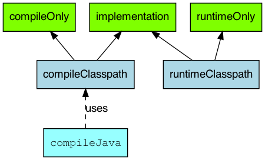
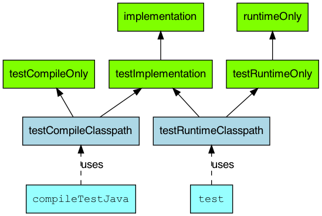

# Gradle. Работа с Зависимостями

В рамках сегодняшней статьи базово познакомимся со спецификой Gradle в работе с зависимостями.

В отличие от прошлой статьи, здесь не будет какой-то концептуальной разницы с Maven. Несмотря на то, что подходы
Maven и Gradle к работе с зависимостями существенно отличаются, идея работы с внешними библиотеками через зависимости
от артефактов, доступ к которым обеспечен через локальные и удаленные репозитории, идентична в обеих системах сборки.
Поскольку целью статьи является знакомство - в первую очередь, сконцентрируемся на терминологии, синтаксисе и тех
аспектах, которые актуальны для новичков на практике.

Как и в других темах, здесь будут просматриваться две характерные для Gradle тенденции:

1. Gradle предлагает большую гибкость в сравнении с Maven. Вплоть до возможности определить собственные операторы (в
   рамках Gradle они называются **конфигурациями***, этот термин будет активно использоваться ниже) с необходимой
   спецификой, которую не предоставляют стандартные конфигурации. Но в эту область в рамках курса погружаться не
   будем - она нужна не часто, а для начинающих специалистов будет, скорее всего, бесполезна на практике;
2. Из-за п.1 существуют более и менее актуальные конфигурации, не все из которых доступны в отдельно
   взятой версии Gradle. Кроме того, гибкость и привязанность функциональности к плагинам (особенно Core-плагинам)
   приводит к тому, что конфигурации в различных плагинах тоже могут отличаться. Поэтому информация из данной статьи
   актуальна, в первую очередь, для приложений с использованием плагина `java` и Gradle 8.5.

> *`Configuration` - объект Gradle, который отвечает за работу с зависимостями. В рамках Gradle-проекта может быть
> (и обычно есть) несколько экземпляров этого объекта, каждый из которых содержит свои настройки - на каком этапе
> жизненного цикла проекта должны быть доступны зависимости (этому посвящен следующий пункт), доступность транзитивных
> зависимостей и пр.

## Classpath

При знакомстве с Maven мы выделяли три этапа жизненного цикла приложения, к которым можно отчасти привязать скоупы
зависимостей: компиляция, тестирование и выполнение.

Gradle в этой области оперирует понятием _classpath_ - мы уже сталкивались с этим термином в контексте Java. В Gradle
определяется несколько classpath'ов и они являются логической надстройкой - это не переменная окружения с путем до
физического расположения нужных классов/библиотек, как в Java, а конфигурация, которая определяет отношение
конкретных зависимостей к конкретному этапу жизненного цикла приложения. При этом физическое расположение самих
классов зависимостей этой абстракцией не регулируется.

Для Gradle (с Java-плагином) характерно выделение четырех classpath'ов:

1. `compileClasspath`. Хранит зависимости, необходимые для компиляции проекта. В целом, идентичен зависимостям этапа
   компиляции в Maven. Речь именно об этапе жизненного цикла, а не compile scope - концепция scope ближе к понятию
   конфигурации в Gradle и о ней мы поговорим чуть позже;
2. `runtimeClasspath`. Хранит зависимости, необходимые на этапе выполнения проекта. Идентичен зависимостям этапа
   выполнения в Maven. В большинстве случаев, зависимость нужна и для этапа компиляции, и для этапа выполнения,
   поэтому добавляется в оба скоупа. Но не всегда;
3. `testCompileClasspath`. То же самое, что и `compileClasspath`, но для компиляции исходного кода тестов;
4. `testRuntimeClasspath`. Полагаю, логика очевидна. Зависимости, необходимые для исполнения тестов.

Конечно, на практике большинство зависимостей должно быть доступно на нескольких или всех этапах жизни проекта,
из-за чего большинство конфигураций предполагает добавление зависимости сразу в несколько classpath'ов.

Стандартным для Java-проектов конфигурациям посвящен следующий пункт.

## Стандартные конфигурации и синтаксис

В целом, этот пункт достаточно хорошо описан в документации к Java-плагину, поэтому текст пункта основан,
преимущественно, на ней:
[документация](https://docs.gradle.org/current/userguide/java_plugin.html#sec:java_plugin_and_dependency_management).



Нас интересуют конфигурации, обозначенные зелеными треугольниками. На самом деле их больше, но именно эти являются
наиболее актуальными и рекомендуемыми к использованию на момент написания статьи.

`compileOnly` и `runtimeOnly` - конфигурации, которые добавляют зависимость только в `compileClasspath` или
`runtimeClasspath` (и `testRuntimeClasspath`) соответственно. Также в соответствующие classpath'ы добавляются
транзитивные зависимости.

Использование `compileOnly`, в целом, очень похож на scope `provided` в Maven. Целесообразность использования этой
конфигурации на практике - вопрос достаточно спорный. Если не уходить в совсем узкие сценарии использования - иногда
`compileOnly` используется в библиотеках, особенно для ситуаций, когда в runtime-могут быть использованы несколько
различных библиотек, реализующих одно API (как, например, реализации логгеров под API SLF4J). Основное преимущество
использования этой конфигурации - меньший размер сборки. Но, во-первых, это преимущество далеко не всегда можно
реализовать, во-вторых - в случае с back-end-разработкой оно не особо важно. Как правило, экономия пары мегабайт
(что для скомпилированной библиотеки достаточно много) на диске сервера не играет какой-либо роли.

`runtimeOnly` - пример использования можно развить из предыдущего. На уровне конечного приложения (например,
использующего библиотеку из предыдущего примера) нам уже нужна реализация конкретного логгера на этапе исполнения -
в таком случае, эту реализацию можно добавить с помощью `runtimeOnly`. Но на практике эта конфигурация встречается
редко.

Обратите внимание, что `runtimeOnly` добавляет зависимость (вместе с транзитивными) в оба runtime-classpath'а, в то
время как `compileOnly` - только в `compileClasspath`.

`implementation` - основная конфигурация для добавления зависимостей. Добавляет указанную зависимость и ее
транзитивные зависимости во все четыре classpath'а. Для Gradle-проектов, не являющихся библиотеками, именно эта
конфигурация будет наиболее популярной.

> **!NB**: При разработке библиотек или Gradle-проектов, подключаемых в другие Gradle-проекты (по факту, тех же
> библиотек, но уровня конкретных проектов) может использоваться, но только в случае, если эта библиотека не должна
> поставлять в подключаемый проект своих транзитивных зависимостей (т.е. их потребуется подключить вручную). Если же
> библиотека должна поставлять и собственные транзитивные зависимости, что встречается намного чаще - обычно используют
> конфигурацию `api` из плагина `java-library`. Но это не относится к теме текущей статьи.
 
Кроме описанных конфигураций в Java-плагине существует еще несколько конфигураций для подключения зависимостей в 
тесты - это особенно актуально для специализированных тестовых библиотек, но иногда таким образом подключаются и 
другие зависимости - например, в тестах для проектов-библиотек (если не используется `api`) или если зависимость не 
нужна в самом проекте.



На схеме выше можно увидеть три новых конфигурации: `testCompileOnly`, `testRuntimeOnly` и `testImplementation`.

Также становится понятно, почему `runtimeOnly` и `implementation` добавляют свои зависимости в test-classpath'ы - 
они являются наследниками `testRuntimeOnly` и `testImplementation` соответственно.

В целом, логика очевидна: `testCompileOnly` добавляет зависимости в `testCompileClasspath`, `testRuntimeOnly` - в 
`testRuntimeClasspath`, `testImplementation` - в оба тестовых classpath'а. 

На практике, по крайней мере, на первых этапах, рекомендую ограничиться использованием `testImplementation` - к 
оставшимся двум конфигурациям обратиться только если первой окажется недостаточно. Тестовые зависимости намного 
менее критичны, чем основные, и углубляться в их тонкую конфигурацию обычно избыточно.

Теперь, ознакомившись с основными конфигурациями разберем синтаксис их применения. Традиционно для Gradle есть как 
минимум два варианта.
Полный:

```groovy
dependencies {
   implementation group: 'org.apache.logging.log4j', name: 'log4j-api', version: '2.20.0'
//   ...
}
```

И сокращенный:

```groovy
dependencies {
   implementation 'org.apache.logging.log4j:log4j-api:2.20.0'
//   ...
}
```

В обоих случаях зависимости указываются в блоке `dependencies` (есть и иные варианты, но они менее популярны). 
Указывается используемая конфигурация, после чего перечисляются атрибуты зависимости. Как правило, используются 
основные три, знакомые нам еще по Maven: `groupId`, `artifactId` (в полной версии указывается как `name`), `version`.
При этом в полной форме записи атрибуты указываются с названиями и перечисляются через запятую, а в сокращенной - 
разделяются лишь двоеточием, при этом записываются как единая строка. 

Фактически, данный синтаксис покрывает 99% сценариев подключения зависимостей. Оставшийся процент остается на 
указание специфических атрибутов или иных тонких настроек. Из таких мы рассмотрим только пример синтаксиса для 
исключения транзитивной зависимости.

Для примера возьмем зависимость `A` с транзитивной зависимостью `B` (как в аналогичном примере для Maven). 
Исключение зависимости в общем виде будет выглядеть так:

```groovy
dependencies {
   implementation('com.some.group:A:6.6.6') {
      exclude group: 'com.another.group', module: 'excluded-artifact'
   }
//   ...
}
```

В данном случае во все classpath'ы будет добавлена зависимость `'com.some.group:A:6.6.6'`, но без транзитивной 
`'com.another.group:excluded-artifact'`.

## Заключение

В рамках данной статьи мы разобрали наиболее базовые инструменты для работы с зависимостями в Gradle. Конечно, этого 
недостаточно, чтобы работать с Gradle эффективно и использовать его на полную мощность. Но это та основа, которая 
позволит использовать данную систему сборки в собственных пет-проектах и не потеряться в случае, если попадется 
коммерческий проект с использованием Gradle. В последнем случае, скорее всего, файлы сборки смогут ввергнуть в ужас 
и далеко не все в них будет понятно. Но даже в этом случае вы сможете выхватить ключевые моменты и, как минимум, 
сможете понять, что гуглить, чтобы разобраться с остальным:)


